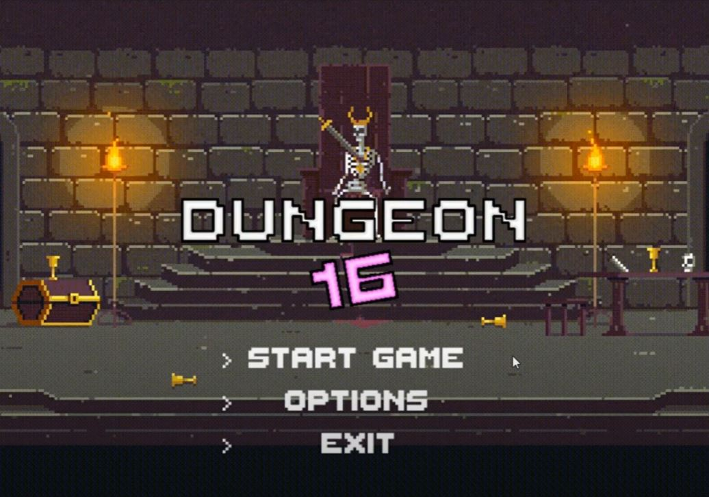
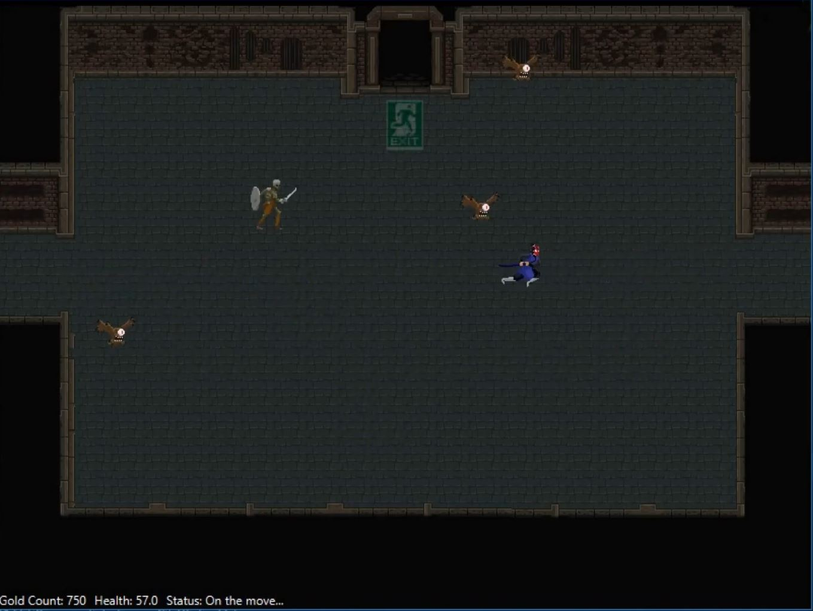

# cs2340_group16
dungeoncrawler.exe's repo for CS2340

## Dungeon 16

### Description:
Dungeon 16 is a dungeon crawler game using DND mechanics, built using JavaFX over one summer semester to learn principles of Object Oriented Programming and Agile Development.

#### Controls:
	The player's controls consist of up, down, left, and right with the WASD keys to move the player character and the E key to attack.

#### Gameplay:
	The player is spawned in a randomized dungeon of many rooms with the starting room clearly marked as such. Starting
	stats are determined based on the player's configuration of the game in the config screen to select player type and difficulty.
	The player may choose from one of three classes, each with different stats.

	As the player proceeds into new rooms through one of the available exits/entrances, they will encounter enemies.
	If the player does not wish to engage the enemies, they may retreat to any previously cleared rooms, but they
	cannot proceed to new rooms until they clear the room of enemies. There are three enemy types.

	Stats are displayed at the bottom left of the screen (Gold Count, Health, Status of player).

	Upon either the player reaching the exit room of the dungeon, the game ends, and a corresponding victory screen is shown with final statistics and the option to play again.
	If the player dies during their run, a lose screen is displayed, with similar options.

	Upon winning or losing, the player may press START to play again or EXIT to close the game.
  
  
